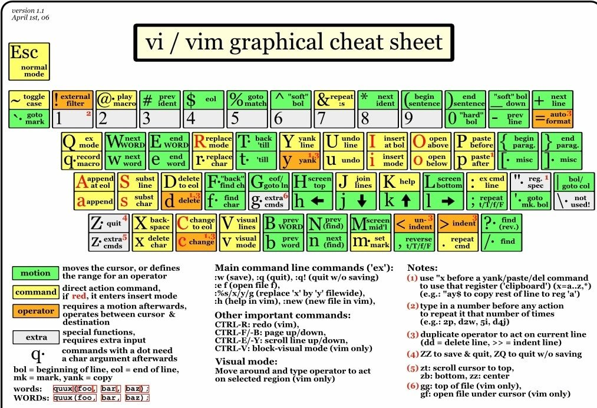

# vim

Add number `N` before any command will execute the command `N` number of times.

## Command
|command|description|
|-|-|
|`:q`|quit|
|`:wq`|quit and save|
|`:q!`|quit without saving|
|`i`|insert mode. press Esc to exit|
|Shift + `i`|go to the first column and go to insert mode|
|`a`|move to one cursor right and go to insert mode|
|Shift + `a`|go to the last column and go to insert mode|
|`v`|visual/highlight line mode. press again or Esc to exit |
|Shift + `v`|visual/highlight block mode. press again or Esc to exit|
|Ctrl + `v`|visual/highlight column|
|`o`|adds new line below current line and go to insert mode.|
|Shift + `o`|adds new line above current line and go to insert mode.|
|`zz`|center cursor or window|
|Esc|clear or exit any command|
|`q` + `<char>`|recording macro to a `<char>`|
|`@` + `<char>`|execute the macro recorded in `<char>`|
|`/` + `n`|find text|

## Vertical navigation
|command|description|
|-|-|
|`h` `j` `k` `l`|← ↓ ↑ → |
|`gg`|go to top|
|Shift + `g`|go to bottom|
|`{`|go up one code block|
|`}`|go down one code block|
|`:` `<num>`| go to line number `<num>`|

## Horizontal navigation
|command|description|
|-|-|
|`w`|go to the next word|
|Shift + `w`|go to the next word after space|
|`b`|go to the previous word|
|Shift + `b`|go to the previous word after space|
|`0`|go to the first column|
|`^`|go to the first column after space|
|`$`|go to the last column|
|`t` `<char>`|go to the previous column of the next `<char>` character of the line|
|Shift + `t` `<char>`|go to the previous column of the next `<char>` character of the line|
|`f` `<char>`|go to the next `<char>` character of the line|
|Shift + `f` `<char>`|go to the next `<char>` character of the line|
|`%`|go to the open and close parenthesis|
|`*`|toggle between words or instances|
|`;`|repeat `t` or `f` command|

## Text
|command|description|
|-|-|
|`u`|undo|
|Ctrl + `r`|redo|
|`yy`|copy|
|`d` + `<nav>`|delete the text affected by the `<nav>`|
|Shift + `d`|delete the text after the cursor of the line|
|`dd`|delete line and copy|
|`p`|paste or paste|
|Shift + `p`|paste before cursor|
|`x`|delete character|
|`c` + `<nav>`|delete and go to insert mode to change any text affected by the `<nav>`|
|Shift + `c`|delete the text after the cursor of the line and go to insert mode|
|`~`|change character case|
|`.`|redo the last action|
|`r`|replace the character of the cursor|
|Shift + `r`|go to overwrite mode|
|`>>`|Indent left|
|`<<`|Indent right|

